<h1 align="center">Hi, I'm Veetaha 👋!</h1>
<h3 align="center">
  Author and maintainer of the <a href="https://github.com/elastio/bon">Rust crate <code>bon</code></a>
</h3>

  Are you interested in my profile? 🐱

  <b>Oh.. Maybe you'll also be interested in <a href="https://github.com/elastio/bon"><code>bon</code></a>?
  </b>

## Social

| [![logo-blog]][blog] &ensp;[**Blog**][blog] | 
-- | 

---

Github Metrics

[blog]: https://bon-rs.com/blog
[logo-blog]: https://github.com/user-attachments/assets/4e84125c-9fec-4c10-ad51-a77652d14087
[logo-twitter]: https://github.com/user-attachments/assets/87d2bd0e-9af7-4dea-8791-d54b0be2744b
[logo-reddit]: https://github.com/user-attachments/assets/3c03826b-a7af-440f-a7bd-8b8b69208231
